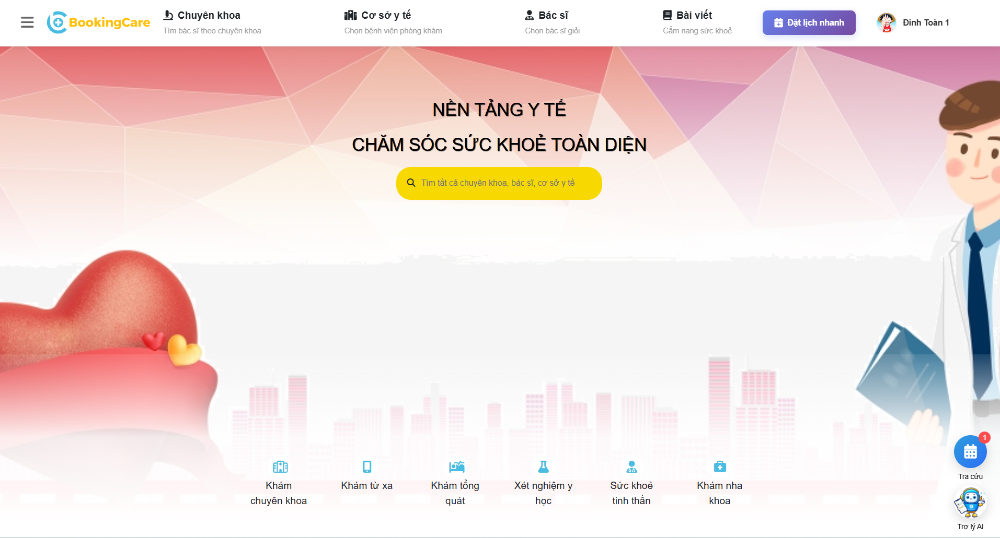
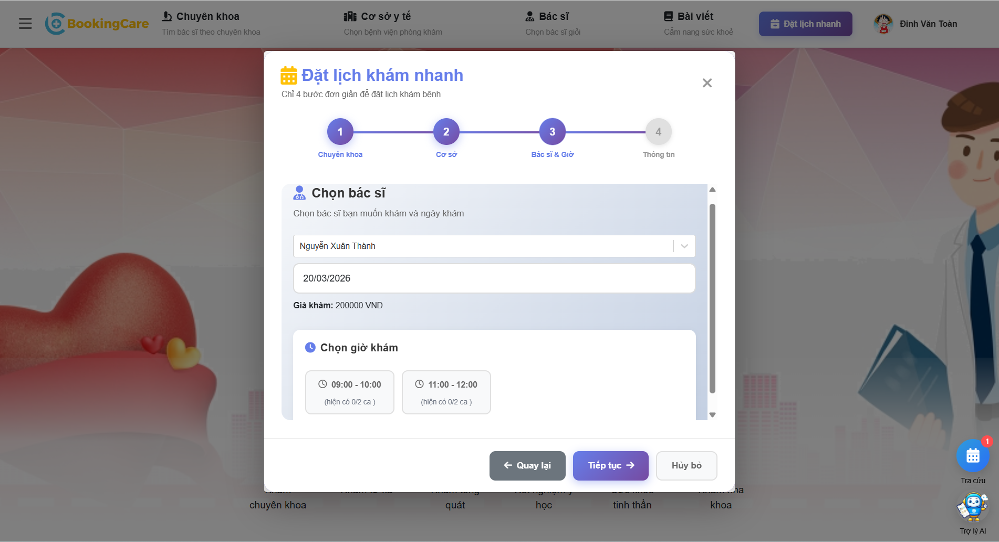
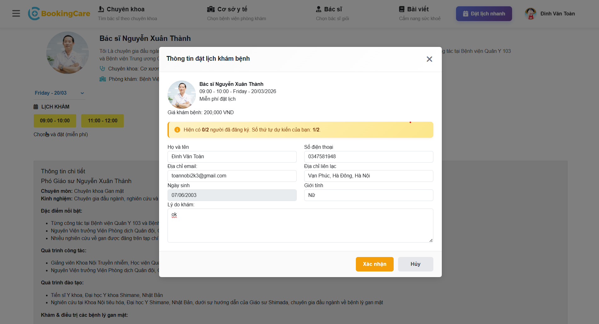
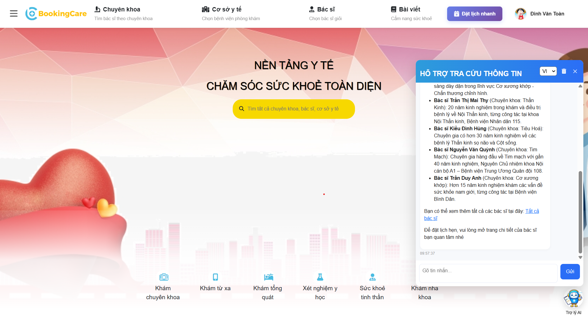
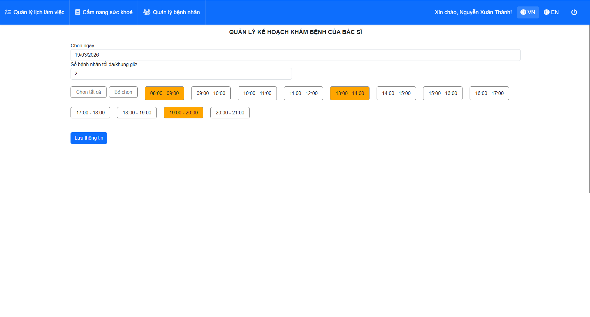
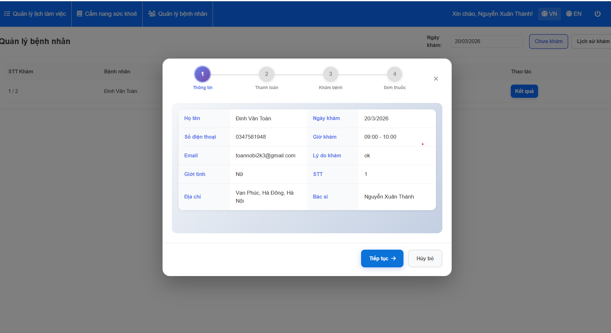
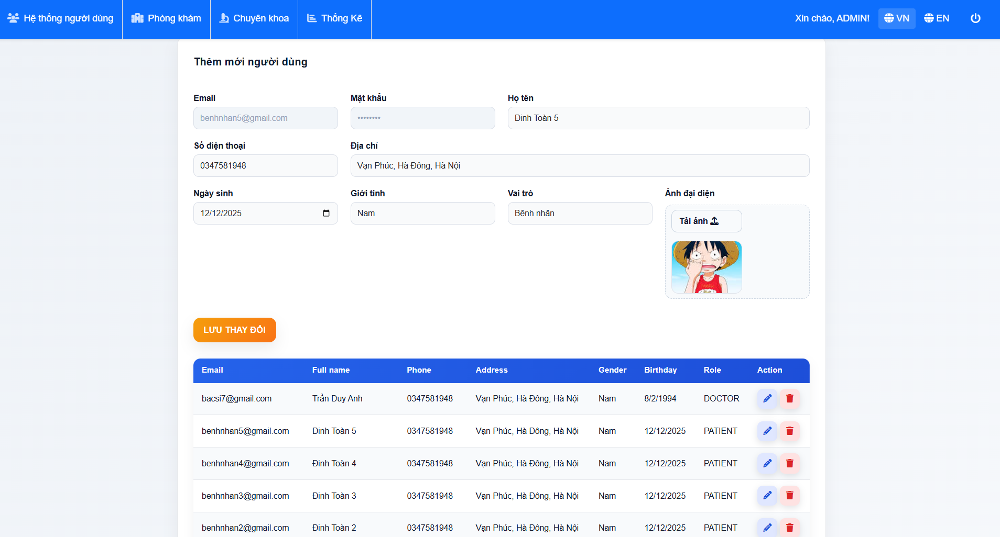
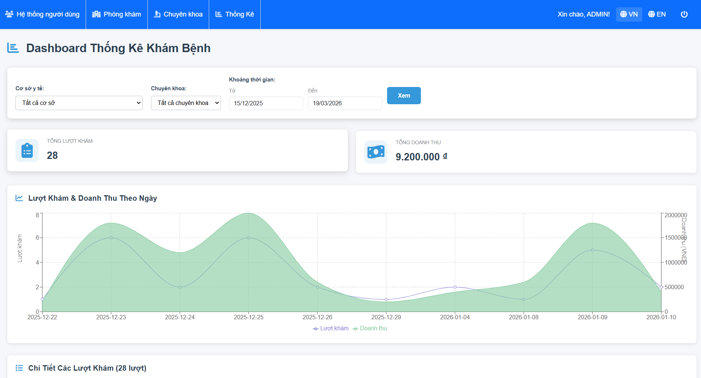

# BookingCare Frontend

Ứng dụng web đặt lịch khám bệnh trực tuyến, cho phép người dùng đặt lịch khám theo nhu cầu và theo dõi lịch sử khám bệnh.

Hệ thống được xây dựng với 3 vai trò chính: Patient, Doctor, Admin, mô phỏng quy trình hoạt động thực tế của một hệ thống y tế.

---

Backend repository: https://github.com/Toanhao/BookingCare-BE

## Giới thiệu

Dự án mô phỏng một hệ thống đặt lịch khám bệnh trực tuyến với nhiều vai trò, tập trung vào các luồng nghiệp vụ chính:

- Luồng đặt lịch khám từ phía người dùng
- Quản lý lịch làm việc và tiếp nhận bệnh nhân của bác sĩ
- Quản trị dữ liệu hệ thống (người dùng, chuyên khoa, phòng khám)

Ứng dụng được thiết kế theo hướng tách biệt rõ ràng giữa giao diện, xử lý logic và giao tiếp API, giúp dễ mở rộng và bảo trì.

---

## Tính năng

### Patient

- Đăng ký, đăng nhập
- Xem bác sĩ, chuyên khoa, phòng khám
- Đặt lịch khám theo nhu cầu
- Xác nhận / hủy lịch, xem lịch sử khám

### Doctor

- Tạo và quản lý lịch làm việc
- Xem danh sách bệnh nhân đã đặt lịch
- Quản lý lịch sử khám

### Admin

- Quản lý người dùng
- Quản lý bác sĩ, chuyên khoa, phòng khám
- Quản lý lịch làm việc của bác sĩ
- Xem thống kê hệ thống

---

## Một số màn hình chính

### 1. Trang chủ



### 2. Đặt lịch
- Hỗ trợ đặt lịch nhanh hoặc đặt lịch theo bác sĩ yêu cầu



### 3. Chat AI
- Hỗ trợ tìm kiếm lịch khám phù hợp / tư vấn cơ bản


### 4. Giao diện bác sĩ
- Quản lý lịch làm việc, quản lý bệnh nhân



### 5. Giao diện quản trị hệ thống
- Quản lý người dùng, xem báo cáo thống kê



---

## Kiến trúc và cách hoạt động

- Frontend giao tiếp với backend thông qua REST API
- Sử dụng cơ chế xác thực bằng token
- Token được lưu tại localStorage và gửi kèm trong mỗi request
- State của toàn bộ ứng dụng được quản lý bằng Redux Toolkit
- Phân quyền dựa trên role (Patient, Doctor, Admin)

Luồng cơ bản:

1. Người dùng đăng nhập và nhận token
2. Frontend gọi API để lấy dữ liệu (bác sĩ, lịch khám, lịch hẹn)
3. Redux store quản lý state tập trung
4. Giao diện hiển thị theo role và dữ liệu nhận được

---

## Công nghệ sử dụng

- React (Vite)
- Redux Toolkit
- React Router
- Axios
- SASS
- Bootstrap

---

## Cài đặt và chạy project

```bash
npm install
npm run dev
```

---

## Kết nối Backend

- Backend repository: https://github.com/Toanhao/BookingCare-BE

```env
VITE_BACKEND_URL=http://localhost:8080
```

---

## Cấu trúc thư mục

```text
src/
├── assets/
├── components/
├── containers/
├── routes/
├── services/
├── store/
├── styles/
├── utils/
├── axios.js
└── index.jsx
```
## Điểm đáng chú ý

- Thiết kế hệ thống nhiều vai trò (Patient / Doctor / Admin)
- Xây dựng luồng đặt lịch hoàn chỉnh từ phía người dùng đến bác sĩ
- Phân tách rõ ràng giữa UI, logic và API (services, store)
- Quản lý state tập trung bằng Redux Toolkit
- Xử lý phân quyền hiển thị giao diện theo role
